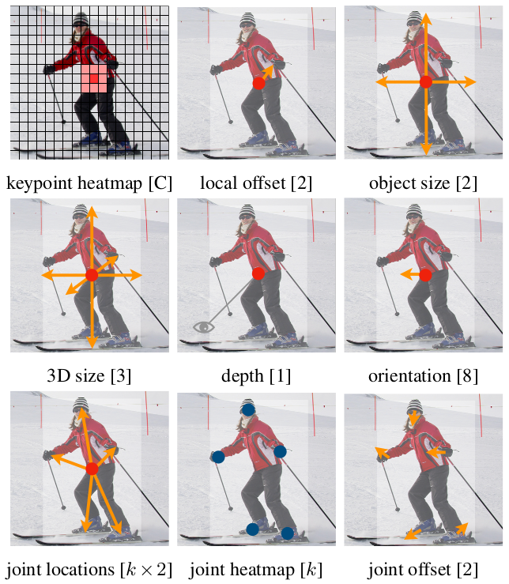
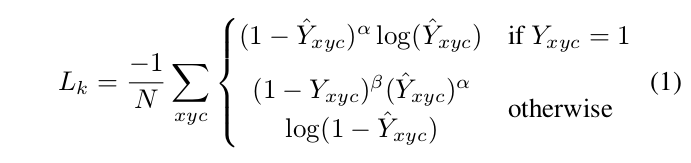
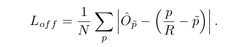
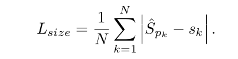
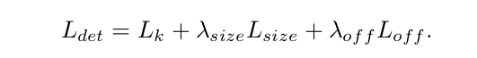
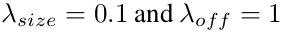

# objects as points

**论文地址:** https://arxiv.org/pdf/1904.07850.pdf
**代码：** https://github.com/xingyizhou/CenterNet

### 基本思想
构建模型时将目标作为一个点——即目标BBox的中心点。采用关键点估计来找到中心点，并回归到其他目标属性，例如尺寸，3D位置，方向，姿态。

第一行：object detection任务，得到keypoint heatmap(W/R * H/R * C)，C为目标种类数, offset补偿下采样由于stride取整产生的偏差，回归得到目标尺寸
第二行：3D object detection任务，直接回归得到目标的深度信息，3D框的尺寸，目标朝向；
第三行：pose estimation任务，将关节点（2D joint）位置作为中心点的偏移量，直接在中心点位置回归出这些偏移量的值。heatmap上训练得到的最近的初始预测值，然后将中心偏移作为一个grouping的线索，来为每个关键点（关节点）分配其最近的人。

### 对比与优势
一，我们分配的"anchor"仅仅是一个位置，没有尺寸。没有手动设置的阈值做前后景分类。（像Faster RCNN会将与GT IOU >0.7的作为前景，<0.3的作为背景，其他不管）；

二，每个目标仅仅有一个正的"anchor"，因此不会用到NMS，提取关键点特征图上局部峰值点（local peaks）；

三，相比较传统目标检测而言（stride 16），使用更大分辨率的输出特征图（stride 4），因此无需用到多重特征图。

### 细节
keypoint heatmap训练：
采用focal loss, 这个损失函数是在标准交叉熵损失基础上修改得到的。这个函数可以通过减少易分类样本的权重，使得模型在训练时更专注于难分类的样本。(参考https://blog.csdn.net/u014380165/article/details/77019084, https://arxiv.org/pdf/1708.02002.pdf)

local offset训练：
采用L1 loss

object size训练：
采用L1 loss

总的损失函数：

其中  

整个网络预测会在每个位置输出 C+4个值(即关键点类别C, 偏移量的x,y，尺寸的w,h)

### 实验
MS COCO dataset, with 28:1% AP at 142 FPS(backbone ResNet-18), 37:4% AP at 52 FPS(backbone DLA-34), and 45:1% AP with multi-scale testing at 1.4 FPS(backbone Hourglass-104).

### 问题与思考
测试的时候找每个category的heatmap peek, 最后提取前100个peek。100个是指每个category都提取100个还是总共提取前100个？

提取了100个peek，就有100个中心点了，输出不需要进一步的后处理？最后每张图输出100个中心点或者bbox? 

#### ysy answser
- 首先提取的应该是所有score的前100，和类别无关。
- 其次后处理是要有的，而且是做NMS，所以这次NMS是绕不开的。
